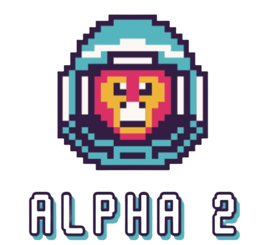

<h1 align="center">Alpha 2</h1>
<br>
<p align="center">

<br>
 
## 📋 Table of contents
  - [Our Idea](#idea)
  - [Documentation and Presentation](#docs)
  - [Team](#collaborators)
  - [Technologies](#technologies)
  - [Installation](#instal)
 
## 💡 Our Idea <a name="idea"></a>
Our objective is to develop an educational and enjoyable game focused on planetary exploration and learning.
#### 
## 📄 Documentation and Presentation <a name="docs"></a>
[Documentation](https://codingburgas-my.sharepoint.com/:w:/g/personal/sbivanov22_codingburgas_bg/Edvlv8nX-vVCsUmEsuBXmHQBwQQSc4-Zsuf7B2Eeb66lgw?e=vBbK4J)
<br>
[Presentation](https://codingburgas-my.sharepoint.com/:p:/g/personal/sbivanov22_codingburgas_bg/EeKMmrb0nPBLj24ASyawAAoBWyZO1daSQ04sP3eZcX5_XA?e=2EPhXq)
 
## 🌱 Team <a name="collaborators"></a>
> 1. **Scrum trainer**	- **SBIvanov22** 
   - ***GitHub profile***: [***SBIvanov22***](https://github.com/sbivanov22)	
> 2. **Back-end**- **MANikolov**	
   - ***GitHub profile***: [***MANikolov22***](https://github.com/MANikolov22)	
> 3. **Back-end Developer** - **VBKanev22** 	
   - ***GitHub profile***: [***VBKanev22***](https://github.com/VBKanev22)
> 4. **Back-end Developer** - **VBBoyanov22**	
   - ***GitHub profile***: [***VBBoyanov22***](https://github.com/VBBoyanov22)
<br>

## ⚒️Tools  <a name="technologies"></a>
<p align="left"> 


</p> 
<br>

## 💻 Languages
<p align="left"> 

</p>

## ⚙️ Installation	<a name = "installation"></a>
````	
1. cmd 
2. git clone https://github.com/codingburgas/2324-space-sprint-project-alpha-2.git
3. start ./vendor/premake/premake5.exe vs2022
````
 
 
## 👏 Appreciation
```
Thank you for scrolling this far! Please consider giving the repo a star ⭐.
```
