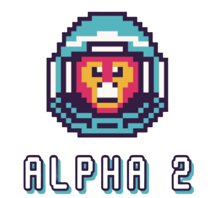

<h1 align="center">Alpha 2</h1>
<br>
<p align="center">

<br>

## 💡 Our Idea
Our idea is about Solar System and the gravity of the planets.
#### 
 
## 📄 Documentation and Presentation
<a href="https://www.microsoft.com/en-ww/microsoft-365/word"></a>[Documentation]()
<br>
<a href="https://www.microsoft.com/en-us/microsoft-365/powerpoint"></a>[Presentation]()

## 🌱 Team
> 1. **Scrum trainer**	- **SBIvanov22** 
   - ***GitHub profile***: [***SBIvanov22***](https://github.com/sbivanov22)	
> 2. **Back-end**- **MANikolov**	
   - ***GitHub profile***: [***MANikolov22***](https://github.com/MANikolov22)	
> 3. **Back-end Developer** - **VBKanev22** 	
   - ***GitHub profile***: [***VBKanev22***](https://github.com/VBKanev22)
> 4. **Back-end Developer** - **VBBoyanov22**	
   - ***GitHub profile***: [***VBBoyanov22***](https://github.com/VBBoyanov22)
<br>
 
## ⚒️Tools
<p align="left"> 


</p> 
<br>
 
## 💻 Languages
 
   <p align="left"> 

</p>
 


## 👏 Appreciation
```
Thank you for scrolling this far! Please consider giving the repo a star ⭐.
```